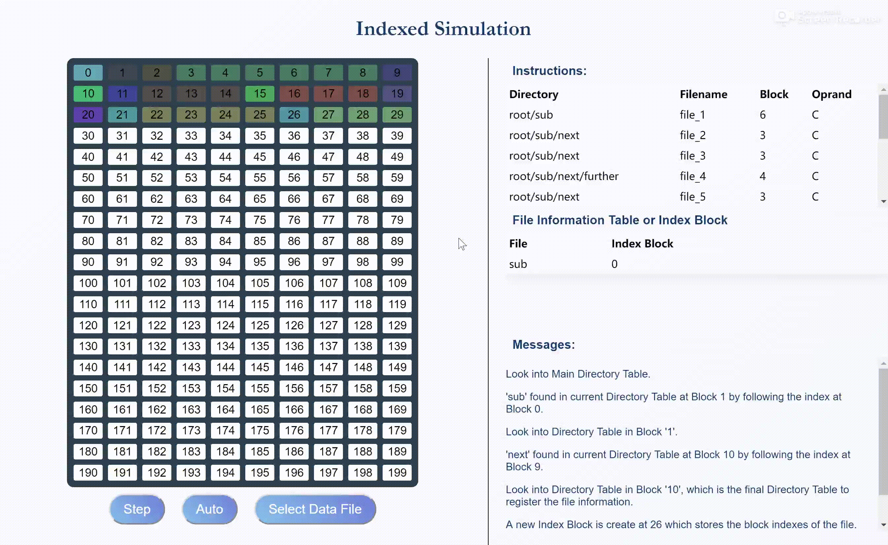

# File Allocation Simulator

A file allocation simulator.

It's the course project (Additional Option) for Computer System Architechture, Professor Mao, Tsinghua SEM.

- [File Allocation Simulator](#File-Allocation-Simulator)
  - [Background](#Background)
  - [Running](#Running)
    - [From Packaged Distribution](#From-Packaged-Distribution)
    - [From Source Code](#From-Source-Code)
      - [Prerequisites](#Prerequisites)
      - [Install dependencies](#Install-dependencies)
      - [Run](#Run)
  - [Application Instruction](#Application-Instruction)
    - [Command Data File](#Command-Data-File)
      - [General](#General)
      - [Operation codes](#Operation-codes)
      - [Data File Generator](#Data-File-Generator)
    - [Main Page](#Main-Page)
    - [Simulation Page](#Simulation-Page)
      - [File Information Table](#File-Information-Table)
        - [In Contiguous Simulation](#In-Contiguous-Simulation)
        - [In Linked Simulation](#In-Linked-Simulation)
        - [In Indexed Simulation](#In-Indexed-Simulation)
  - [Known Problems](#Known-Problems)
  - [External Resources Used in the Project](#External-Resources-Used-in-the-Project)


## Background

"File allocation" refers to the allocation methods described in Chapter 12.4 of *Operating System Concepts, Ninth Edition* by Abraham Silberschatz, Peter Baer Galvin and Greg Gagne.

The three allocation methods are:

- Contiguous Allocation
- Linked Allocation
- Indexed Allocation

Some assumptions in this simulator are:

- FAT is not used for linked allocation. The pointers are assumed to be in the file blocks instead.
- Combined scheme is not used for indexed allocation, i.e there is only direct blocks.


## Running

### From Packaged Distribution

[Download the release](https://github.com/Vopaaz/File-Allocation-Simulator/releases) and unzip the zip file. Then run `file-allocation-simulator.exe`.

The only supported platform is Windows 10 x64.

### From Source Code

#### Prerequisites

- Node.js
- npm

#### Install dependencies

```bash
$ npm install
```

#### Run

```bash
$ npm start
```

## Application Instruction

### Command Data File

#### General

The command data file must be a csv-like formatted text file, with four columns and any numbers of rows.

The meaning of each columns are:

| Directory | File Name | Blocks or # of the blocks | Operation code |
| --------- | --------- | ------------------------- | -------------- |

- The separator should be `,` and it should not present at the end of each row.
- The spaces within the cell, which makes the source data file easier to read, is allowed.
- Directory must starts with `root`
- Multi-level directory should be separated by `/`
- Operation code must be `C`, `R`, `W` or `D`, which will be explained in the following section

Here is an example of a valid instruction file:

```text
root, file_1, 6, C
root, file_1, 2, R
root/sub, file_2, 3, C
root/sub, file_2, 1, W
root, file_1, 6, D
```

You can find more of them at [the test folder](https://github.com/Vopaaz/File-Allocation-Simulator/tree/master/test/assets).


#### Operation codes

- `C` stands for create.

A file, located in `Directory` named `File Name` taking up `Blocks` number of blocks will be created.

- `R` stands for read.

The No. `Blocks` block of file `File Name` which locates in `Directory` will be read.


- `W` stands for write.

The No. `Blocks` block of file `File Name` which locates in `Directory` will be written.

- `D` stands for delete.

The file `File Name` which locates in `Directory` will be deleted. Note that the `Block` field in this command will be **ignored** according to the instruction of Prof. Mao. The **whole** file will be deleted whatever the `Block` field is, instead of deleting only the No. `Block` block.

#### Data File Generator

A very simple python script was provided to generate random data file for testing.

- Environment: `Python 3.7`
- Dependencies: `pandas`, you can install by `pip install pandas`

Running:

```bash
$ python test/scripts/generate.py NUMBER
```

- Argument `NUMBER` is the number of instructions generated.
- It should either be an integer greater than 1, or omitted, where the script will generate 20 instructions.

The instruction file will be created at `test/assets/random-tests`, named with current time.

### Main Page


On main page, you can click the first three buttons to open a simulation window, or click the `Documentation` button, which will direct you to the [github page of this README](https://github.com/Vopaaz/File-Allocation-Simulator/blob/master/README.md).

### Simulation Page


The left part in the simulation page is the file blocks. The white ones are empty and the colored ones are full, either storing a file/directory or is a index block in the indexed allocation simulation. If one file takes up several blocks, these blocks will have the same color.

When a block is being read, its number will become blinking white `R!`. When a block is being written, its number will become blinking `W!`.

There are also three buttons at the bottom-left. `Step` will execute one instruction. `Auto` will automatically execute the instructions every 2 seconds. And the auto-execution will stop after you click it again. `Select Data File` will ask you to choose the source command file, which was discussed [above](#Command-Data-File).

Note that the `Auto` button is the only "on-off" switch to the auto execution. That is, if you clicked `Auto`, finished one simulation, and uses the `Select Data File` to open another simulation. The second simulation **will automatically start**, unless you click the `Auto` button again.

The right part will display the necessary information.

- `Instructions` lists the instructions in the data file.
- `File Information Table` part will be discussed in the next section.
- `Messages` tells you the detailed process of the execution of the command.

#### File Information Table

The `File Information Table` part in the simulation page displays various information.

#####  In Contiguous Simulation

The columns of the table will be:

| File | Start | Length |
| ---- | ----- | ------ |

Each stands for: File Name, No. of the starting Block, length of the file.

If there is multi-level directory, then certain blocks will be used to save the sub-directory.

You can click that block to see the file information table contained in that block. And you can click the title `File Information Table` to get back to the main directory table.


#####  In Linked Simulation

The name will be changed to `File Information Table or Block Pointer`. It displays both the directory table and the file pointer.

Initially, the colums of the table will be:

| File | Start | End |
| ---- | ----- | --- |

Each stands for the file name, the start block and the end block.

You can also click a block containing a sub-directory to see its directory table.

If you click a block containing a part of the file, the table will display its pointer information. The columns will be:

| File | Next |
| ---- | ---- |

Here `Next` stands for the next block of this file.

You can return to the main directory by clicking `File Information Table or Block Pointer` as well.


##### In Indexed Simulation

The name will be changed to `File Information Table or Index Block`. It displays both the directory table and the index block.

Initially, the colums of the table will be:

| File | Index Block |
| ---- | ----------- |

Each stands for the file name, and its index block.

You can also click a block containing a sub-directory to see its directory table.

If you click an index block, the table will display the contained index information. The columns will be:

| Index |
| ----- |

Here `Index` stands for the block locations of this file.

You can return to the main directory by clicking `File Information Table or Index Block` as well.




## Known Problems

1. This application does not have good resolution adaptation and monitor-size adaption. On different devices, the display may differ, and even prevent from normal using. You can try to set different resolution on your monitor but I do not guarantee the effect.
2. If you click the `Step` button too fast, the `R!` or `W!` words may stay on the panel rather than returning back to the block number.


## External Resources Used in the Project

- The project is built with [electron](https://github.com/electron/electron).
- [Electron-forge](https://github.com/electron-userland/electron-forge) initialized the boilerplate and package the distributable.
- Table Style is derived from [codepen.io](https://codepen.io/alexerlandsson/pen/mPWgpO?editors=0110), and was slightly modified.
- Button Style is built with [css3 button generator](https://www.css3buttongenerator.com/).
